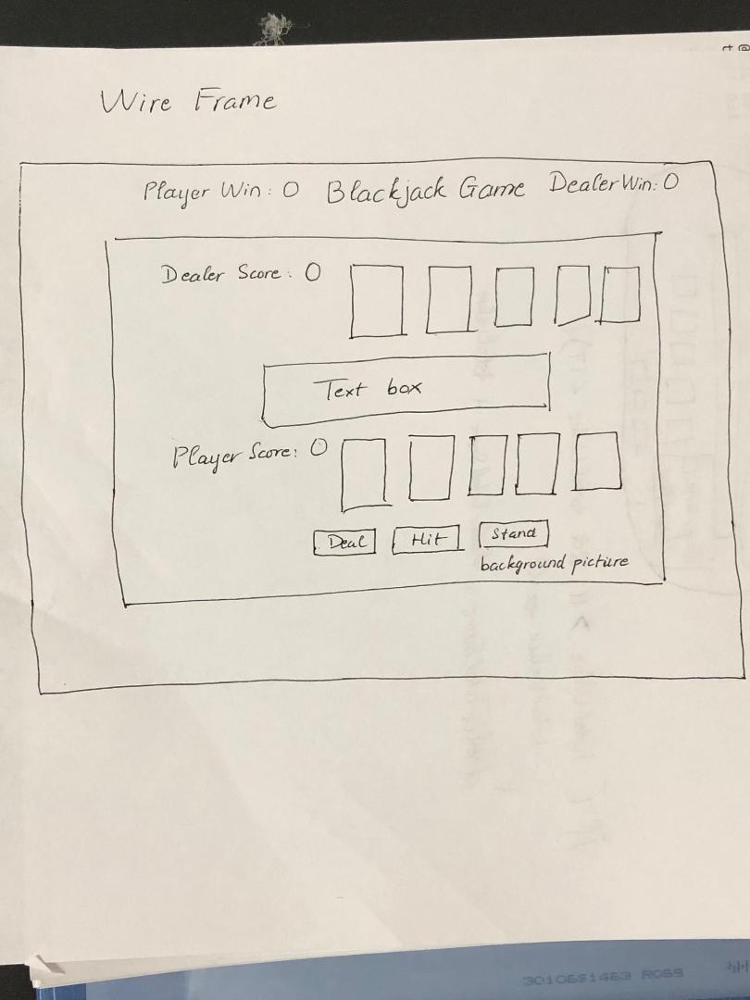
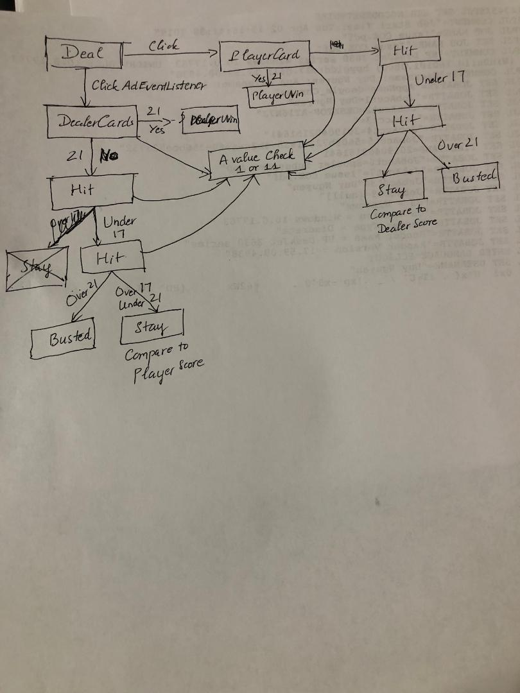

# PROJECT #1: BLACKJACK GAME

## Overview
For project #1, I choose to create simple Blackjack game.

The object of Blackjack is for the participant to beat the dealer by getting the count as close to 21 as possible, but not over. Two cards will be dealt when the player hits "Deal". If necessary, the player can choose to "Hit" to try and reach their desired count, or "Stand" and stay with their hand. The participant or the dealer will "Bust" if the hand is over 21, resulting in a loss. A new game will then start when the player hits the "Deal" button. 

## Technologies Used
- Languages - HTML, CSS, Javascript, JQuery.
- Project Planning - Trello.
- Text Edition - Visual Studio Code.

## Links
- Project Planning Trello:
https://trello.com/b/ZZkyEx8g/blackjack-game
- Project Hosted Address:
https://blackjack-game-building.netlify.com/

## Features
- Deal Button
- Hit Button
- Stand Button
- Using some animated for buttons from Animate.css 

## Future Improvements
- Create better animate to make the game more reality.
- Create a deck of cards
- Create cards dealing animate
- Create betting option for player
- Create sound for better game play experience

## Wireframe

## Storyboard

